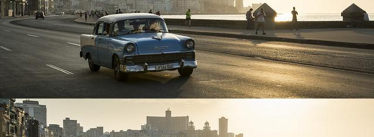

## 🦾 Motivation
This is the project work of group 16 for the EPFL course "Deep learning for autonomous vehicles". Our goal was to perform two experiments: implementing a new dataset and using a state-of-the-art data augmentation technique. The dataset was chosen to be DrivingStereo, since it has never been implemented before on Monocular Camera Depth Estimation. It also has a larger amount of data to train and test than multiple other datasets, and it contains frames from different weather conditions. In our project, the focus was to use it only for Monocular Depth Estimation, even though it is primarily used for stereo images. The data augmentation method was chosen to be CutFlip introduced in Monocular Depth Estimation by [URCDC-Depth](https://github.com/ShuweiShao/URCDC-Depth). The choice for CutFlip was based on it being part of a state-of-the-art work and computationally light, which is necessary for these kinds of projects.

## ⚙️ Setup
Assuming a fresh Anaconda or Venv distribution, you can install the dependencies with:
```shell
pip3 install torch==1.9.0 torchvision==0.10.0 torchaudio==0.9.0
pip install dominate==2.4.0 Pillow==6.1.0 visdom==0.1.8
pip install tensorboardX==1.4 opencv-python  matplotlib scikit-image
pip3 install mmcv-full==1.3.0 mmsegmentation==0.11.0  
pip install timm einops IPython
```
We ran our experiments with PyTorch 1.9.0, CUDA 11.1.1 and Python 3.7.7.

## 💻 Experiments
We started with [MonoViT](https://github.com/zxcqlf/MonoViT) as our backbone code but couldn't get it working so we had to switch to [Monodepth2](https://github.com/nianticlabs/monodepth2) which has been previously used as a backbone. We did our implementations to that code. For the evaluation metrics we would have used Abs Rel, Sq Rel, RMSE, RMSE log, delta < 1.25, delta < 1.25^2, and delta < 1.25^3.

## 💾 DrivingStereo dataset
Our dataset is called DrivingStereo. It is a "A Large-Scale Dataset for Stereo Matching in Autonomous Driving Scenarios". It can be found online from [DrivingStereo](https://drivingstereo-dataset.github.io/). You can download the images to your computer if you have an enormous amount of space. We used the dataset by accessing it via clusters located in SCITAS. The training images are in form of .jpg and depth map images in form of .png. We tried to use left training images to train our model. Evaluation data was created by taking 20,000 frames from training data.

Additional information about the dataset: "Google Drive and Baidu Cloud links are available for the downloading of left images, right images, disparity maps, and depth maps. The total number of our dataset is 182188, where the training set has 174437 pairs and the testing set has 7751 pairs. For convenience, we compress the images by sequences. Different from the original resolution reported in the paper, all of the images and maps are downsampled to the half resolution. The average size of image is 881x400. In addition to the sequential training data, we also select 2000 frames with 4 different weathers (sunny, cloudy, foggy, rainy) for specific requests."

## 🧪 Testing
To test the training of the model with slurm, type the command:
```shell
Sinteract -g gpu:1 -p gpu -c 12 -m 16G -t 00:20:00
python train.py
```
For running the code via the clusters, use the following commands (even though the code is not working correctly):
```shell
sbatch script
```
CutFlip_tester.py can be used to test the CutFlip functionality after having selected a path for your input image. It can be ran locally or in a venv. Weigths are automatically downloaded when running the code so no worries about that.

## 🖼️ Results
We got the data augmentation method working as we wanted to. Below you will find an image that is modified with CutFlip method from an input image. The CutFlip function takes in whatever image it is given to generate cutting and flipping features. The vertical location of the horizontal cut is randomized. Also, CutFlip is randomly assigned to only some of the frames for better generalization.

<p align="center">
  
</p>

Our code was able to get images from the DrivingStereo dataset. Below you will find an example of the kind of depth maps the dataset contains.

<p align="center">
  
</p>

To our knowledge we achieved to produce most of the main functions for implementing the DrivingStereo dataset. We managed to print out running updates about training with some information missing e.g., correct calculation of the loss.

## 🤷‍♂️ Conclusion
We partially achieved our goal. We succeeded in implementing our data augmentation method. Training of our model didn't work out as we wanted. Close to the end of the project, we could identify some reasons why we didn't succeed as planned. Reading and processing of the folders and files were dificult to adapt due to different structures of KITTI and DrivingStereo datasets. Modifications we already made were broad and located in multiple files due to complex data structure. To best of our knowledge, no other work had implemented this dataset for training in Monocular Camera Depth Estimation, and only one had implemented it for training in general. With some more time we could have overcome these issues.

## ⚠️ Info
Due to not being able to train the code properly, we didn´t find it useful or necessary to submit an interefence script.


----------------------------------------------------------------------------------------------------------------------------------------------------------------------------


# Monodepth2

This is the reference PyTorch implementation for training and testing depth estimation models using the method described in

> **Digging into Self-Supervised Monocular Depth Prediction**
>
> [Clément Godard](http://www0.cs.ucl.ac.uk/staff/C.Godard/), [Oisin Mac Aodha](http://vision.caltech.edu/~macaodha/), [Michael Firman](http://www.michaelfirman.co.uk) and [Gabriel J. Brostow](http://www0.cs.ucl.ac.uk/staff/g.brostow/)
>
> [ICCV 2019 (arXiv pdf)](https://arxiv.org/abs/1806.01260)

<p align="center">
  
</p>

This code is for non-commercial use; please see the [license file](LICENSE) for terms.

If you find our work useful in your research please consider citing our paper:

```
@article{monodepth2,
  title     = {Digging into Self-Supervised Monocular Depth Prediction},
  author    = {Cl{\'{e}}ment Godard and
               Oisin {Mac Aodha} and
               Michael Firman and
               Gabriel J. Brostow},
  booktitle = {The International Conference on Computer Vision (ICCV)},
  month = {October},
year = {2019}
}
```


## ⚙️ Setup

Assuming a fresh [Anaconda](https://www.anaconda.com/download/) distribution, you can install the dependencies with:
```shell
conda install pytorch=0.4.1 torchvision=0.2.1 -c pytorch
pip install tensorboardX==1.4
conda install opencv=3.3.1   # just needed for evaluation
```
We ran our experiments with PyTorch 0.4.1, CUDA 9.1, Python 3.6.6 and Ubuntu 18.04.
We have also successfully trained models with PyTorch 1.0, and our code is compatible with Python 2.7. You may have issues installing OpenCV version 3.3.1 if you use Python 3.7, we recommend to create a virtual environment with Python 3.6.6 `conda create -n monodepth2 python=3.6.6 anaconda `.

<!-- We recommend using a [conda environment](https://conda.io/docs/user-guide/tasks/manage-environments.html) to avoid dependency conflicts.

We also recommend using `pillow-simd` instead of `pillow` for faster image preprocessing in the dataloaders. -->


## 🖼️ Prediction for a single image

You can predict scaled disparity for a single image with:

```shell
python test_simple.py --image_path assets/test_image.jpg --model_name mono+stereo_640x192
```

or, if you are using a stereo-trained model, you can estimate metric depth with

```shell
python test_simple.py --image_path assets/test_image.jpg --model_name mono+stereo_640x192 --pred_metric_depth
```

On its first run either of these commands will download the `mono+stereo_640x192` pretrained model (99MB) into the `models/` folder.
We provide the following  options for `--model_name`:

| `--model_name`          | Training modality | Imagenet pretrained? | Model resolution  | KITTI abs. rel. error |  delta < 1.25  |
|-------------------------|-------------------|--------------------------|-----------------|------|----------------|
| [`mono_640x192`](https://storage.googleapis.com/niantic-lon-static/research/monodepth2/mono_640x192.zip)          | Mono              | Yes | 640 x 192                | 0.115                 | 0.877          |
| [`stereo_640x192`](https://storage.googleapis.com/niantic-lon-static/research/monodepth2/stereo_640x192.zip)        | Stereo            | Yes | 640 x 192                | 0.109                 | 0.864          |
| [`mono+stereo_640x192`](https://storage.googleapis.com/niantic-lon-static/research/monodepth2/mono%2Bstereo_640x192.zip)   | Mono + Stereo     | Yes | 640 x 192                | 0.106                 | 0.874          |
| [`mono_1024x320`](https://storage.googleapis.com/niantic-lon-static/research/monodepth2/mono_1024x320.zip)         | Mono              | Yes | 1024 x 320               | 0.115                 | 0.879          |
| [`stereo_1024x320`](https://storage.googleapis.com/niantic-lon-static/research/monodepth2/stereo_1024x320.zip)       | Stereo            | Yes | 1024 x 320               | 0.107                 | 0.874          |
| [`mono+stereo_1024x320`](https://storage.googleapis.com/niantic-lon-static/research/monodepth2/mono%2Bstereo_1024x320.zip)  | Mono + Stereo     | Yes | 1024 x 320               | 0.106                 | 0.876          |
| [`mono_no_pt_640x192`](https://storage.googleapis.com/niantic-lon-static/research/monodepth2/mono_no_pt_640x192.zip)          | Mono              | No | 640 x 192                | 0.132                 | 0.845          |
| [`stereo_no_pt_640x192`](https://storage.googleapis.com/niantic-lon-static/research/monodepth2/stereo_no_pt_640x192.zip)        | Stereo            | No | 640 x 192                | 0.130                 | 0.831          |
| [`mono+stereo_no_pt_640x192`](https://storage.googleapis.com/niantic-lon-static/research/monodepth2/mono%2Bstereo_no_pt_640x192.zip)   | Mono + Stereo     | No | 640 x 192                | 0.127                 | 0.836          |

You can also download models trained on the odometry split with [monocular](https://storage.googleapis.com/niantic-lon-static/research/monodepth2/mono_odom_640x192.zip) and [mono+stereo](https://storage.googleapis.com/niantic-lon-static/research/monodepth2/mono%2Bstereo_odom_640x192.zip) training modalities.

Finally, we provide resnet 50 depth estimation models trained with [ImageNet pretrained weights](https://storage.googleapis.com/niantic-lon-static/research/monodepth2/mono_resnet50_640x192.zip) and [trained from scratch](https://storage.googleapis.com/niantic-lon-static/research/monodepth2/mono_resnet50_no_pt_640x192.zip).
Make sure to set `--num_layers 50` if using these.

## 💾 KITTI training data

You can download the entire [raw KITTI dataset](http://www.cvlibs.net/datasets/kitti/raw_data.php) by running:
```shell
wget -i splits/kitti_archives_to_download.txt -P kitti_data/
```
Then unzip with
```shell
cd kitti_data
unzip "*.zip"
cd ..
```
**Warning:** it weighs about **175GB**, so make sure you have enough space to unzip too!

Our default settings expect that you have converted the png images to jpeg with this command, **which also deletes the raw KITTI `.png` files**:
```shell
find kitti_data/ -name '*.png' | parallel 'convert -quality 92 -sampling-factor 2x2,1x1,1x1 {.}.png {.}.jpg && rm {}'
```
**or** you can skip this conversion step and train from raw png files by adding the flag `--png` when training, at the expense of slower load times.

The above conversion command creates images which match our experiments, where KITTI `.png` images were converted to `.jpg` on Ubuntu 16.04 with default chroma subsampling `2x2,1x1,1x1`.
We found that Ubuntu 18.04 defaults to `2x2,2x2,2x2`, which gives different results, hence the explicit parameter in the conversion command.

You can also place the KITTI dataset wherever you like and point towards it with the `--data_path` flag during training and evaluation.

**Splits**

The train/test/validation splits are defined in the `splits/` folder.
By default, the code will train a depth model using [Zhou's subset](https://github.com/tinghuiz/SfMLearner) of the standard Eigen split of KITTI, which is designed for monocular training.
You can also train a model using the new [benchmark split](http://www.cvlibs.net/datasets/kitti/eval_depth.php?benchmark=depth_prediction) or the [odometry split](http://www.cvlibs.net/datasets/kitti/eval_odometry.php) by setting the `--split` flag.


**Custom dataset**

You can train on a custom monocular or stereo dataset by writing a new dataloader class which inherits from `MonoDataset` – see the `KITTIDataset` class in `datasets/kitti_dataset.py` for an example.


## ⏳ Training

By default models and tensorboard event files are saved to `~/tmp/<model_name>`.
This can be changed with the `--log_dir` flag.


**Monocular training:**
```shell
python train.py --model_name mono_model
```

**Stereo training:**

Our code defaults to using Zhou's subsampled Eigen training data. For stereo-only training we have to specify that we want to use the full Eigen training set – see paper for details.
```shell
python train.py --model_name stereo_model \
  --frame_ids 0 --use_stereo --split eigen_full
```

**Monocular + stereo training:**
```shell
python train.py --model_name mono+stereo_model \
  --frame_ids 0 -1 1 --use_stereo
```


### GPUs

The code can only be run on a single GPU.
You can specify which GPU to use with the `CUDA_VISIBLE_DEVICES` environment variable:
```shell
CUDA_VISIBLE_DEVICES=2 python train.py --model_name mono_model
```

All our experiments were performed on a single NVIDIA Titan Xp.

| Training modality | Approximate GPU memory  | Approximate training time   |
|-------------------|-------------------------|-----------------------------|
| Mono              | 9GB                     | 12 hours                    |
| Stereo            | 6GB                     | 8 hours                     |
| Mono + Stereo     | 11GB                    | 15 hours                    |


### 💽 Finetuning a pretrained model

Add the following to the training command to load an existing model for finetuning:
```shell
python train.py --model_name finetuned_mono --load_weights_folder ~/tmp/mono_model/models/weights_19
```


### 🔧 Other training options

Run `python train.py -h` (or look at `options.py`) to see the range of other training options, such as learning rates and ablation settings.


## 📊 KITTI evaluation

To prepare the ground truth depth maps run:
```shell
python export_gt_depth.py --data_path kitti_data --split eigen
python export_gt_depth.py --data_path kitti_data --split eigen_benchmark
```
...assuming that you have placed the KITTI dataset in the default location of `./kitti_data/`.

The following example command evaluates the epoch 19 weights of a model named `mono_model`:
```shell
python evaluate_depth.py --load_weights_folder ~/tmp/mono_model/models/weights_19/ --eval_mono
```
For stereo models, you must use the `--eval_stereo` flag (see note below):
```shell
python evaluate_depth.py --load_weights_folder ~/tmp/stereo_model/models/weights_19/ --eval_stereo
```
If you train your own model with our code you are likely to see slight differences to the publication results due to randomization in the weights initialization and data loading.

An additional parameter `--eval_split` can be set.
The three different values possible for `eval_split` are explained here:

| `--eval_split`        | Test set size | For models trained with... | Description  |
|-----------------------|---------------|----------------------------|--------------|
| **`eigen`**           | 697           | `--split eigen_zhou` (default) or `--split eigen_full` | The standard Eigen test files |
| **`eigen_benchmark`** | 652           | `--split eigen_zhou` (default) or `--split eigen_full`  | Evaluate with the improved ground truth from the [new KITTI depth benchmark](http://www.cvlibs.net/datasets/kitti/eval_depth.php?benchmark=depth_prediction) |
| **`benchmark`**       | 500           | `--split benchmark`        | The [new KITTI depth benchmark](http://www.cvlibs.net/datasets/kitti/eval_depth.php?benchmark=depth_prediction) test files. |

Because no ground truth is available for the new KITTI depth benchmark, no scores will be reported  when `--eval_split benchmark` is set.
Instead, a set of `.png` images will be saved to disk ready for upload to the evaluation server.


**External disparities evaluation**

Finally you can also use `evaluate_depth.py` to evaluate raw disparities (or inverse depth) from other methods by using the `--ext_disp_to_eval` flag:

```shell
python evaluate_depth.py --ext_disp_to_eval ~/other_method_disp.npy
```


**📷📷 Note on stereo evaluation**

Our stereo models are trained with an effective baseline of `0.1` units, while the actual KITTI stereo rig has a baseline of `0.54m`. This means a scaling of `5.4` must be applied for evaluation.
In addition, for models trained with stereo supervision we disable median scaling.
Setting the `--eval_stereo` flag when evaluating will automatically disable median scaling and scale predicted depths by `5.4`.


**⤴️⤵️ Odometry evaluation**

We include code for evaluating poses predicted by models trained with `--split odom --dataset kitti_odom --data_path /path/to/kitti/odometry/dataset`.

For this evaluation, the [KITTI odometry dataset](http://www.cvlibs.net/datasets/kitti/eval_odometry.php) **(color, 65GB)** and **ground truth poses** zip files must be downloaded.
As above, we assume that the pngs have been converted to jpgs.

If this data has been unzipped to folder `kitti_odom`, a model can be evaluated with:
```shell
python evaluate_pose.py --eval_split odom_9 --load_weights_folder ./odom_split.M/models/weights_29 --data_path kitti_odom/
python evaluate_pose.py --eval_split odom_10 --load_weights_folder ./odom_split.M/models/weights_29 --data_path kitti_odom/
```


## 📦 Precomputed results

You can download our precomputed disparity predictions from the following links:


| Training modality | Input size  | `.npy` filesize | Eigen disparities                                                                             |
|-------------------|-------------|-----------------|-----------------------------------------------------------------------------------------------|
| Mono              | 640 x 192   | 343 MB          | [Download 🔗](https://storage.googleapis.com/niantic-lon-static/research/monodepth2/mono_640x192_eigen.npy)           |
| Stereo            | 640 x 192   | 343 MB          | [Download 🔗](https://storage.googleapis.com/niantic-lon-static/research/monodepth2/stereo_640x192_eigen.npy)         |
| Mono + Stereo     | 640 x 192   | 343 MB          | [Download 🔗](https://storage.googleapis.com/niantic-lon-static/research/monodepth2/mono%2Bstereo_640x192_eigen.npy)  |
| Mono              | 1024 x 320  | 914 MB          | [Download 🔗](https://storage.googleapis.com/niantic-lon-static/research/monodepth2/mono_1024x320_eigen.npy)          |
| Stereo            | 1024 x 320  | 914 MB          | [Download 🔗](https://storage.googleapis.com/niantic-lon-static/research/monodepth2/stereo_1024x320_eigen.npy)        |
| Mono + Stereo     | 1024 x 320  | 914 MB          | [Download 🔗](https://storage.googleapis.com/niantic-lon-static/research/monodepth2/mono%2Bstereo_1024x320_eigen.npy) |


## 👩‍⚖️ License
Copyright © Niantic, Inc. 2019. Patent Pending.
All rights reserved.
Please see the [license file](LICENSE) for terms.
